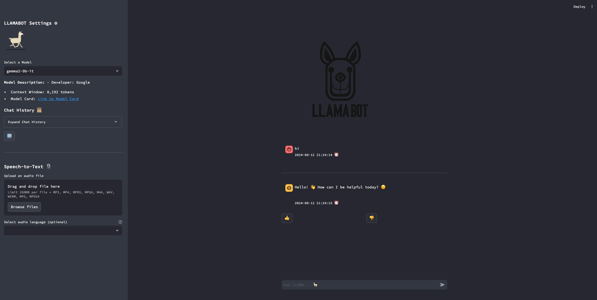

# LLAMABOT 🦙

This is a Streamlit-based chatbot application powered by Groq's powerful LLMs. It provides a user-friendly interface for
interacting with large language models, including features like speech-to-text, chat history, and content moderation.

## Features

- **Chat Interaction:** Engage in conversations with cutting-edge LLMs from Groq.
- **Speech-to-Text:** Transcribe audio files into text using Groq's Whisper API.
- **Chat History:** View and search past conversations.
- **Content Moderation:** Ensure safe and responsible interactions using Llama Guard 3 for content moderation.
- **Model Selection:** Choose from a variety of Groq LLMs, each with its own strengths and capabilities.
- **Feedback Mechanism:** Provide feedback on the chatbot's responses to help improve its performance.

## Installation and Setup

1. **Clone the Repository:**

```bash
   git clone https://github.com/bantoinese83/llamabot.git 
```

2. **Install Dependencies:**

```bash
   cd llamabot
   pip install -r requirements.txt
```

3. **Configure API Key:**
- Create a `config.json` file in the project directory.
- Add your Groq API key to the file:
 ```json
{
  "GROQ_API_KEY": "YOUR_GROQ_API_KEY"
}
```
4. **Run the App:**

```bash
   streamlit run app.py
```

## Usage

- **Select a Model:** Choose your desired Groq LLM from the sidebar.
- **Chat Input:** Type your message in the chat input field and press Enter.
- **Speech-to-Text:** Upload an audio file and click "Transcribe" to convert it into text.
- **View Chat History:** Expand the "Chat History" section in the sidebar to see past conversations. Use the search bar
  to find specific messages.
- **Provide Feedback:** Use the thumbs up/down buttons to rate the chatbot's responses.

## Technologies Used

- **Streamlit:** Python framework for building interactive web apps.
- **Groq:** Platform providing access to high-performance LLMs, including Llama Guard 3.
- **SQLAlchemy:** Python SQL toolkit and Object Relational Mapper.
- **SQLite:** Lightweight database for storing chat history and feedback.
- **Lottie Animations:** Engaging animations for a more visually appealing interface.


 
